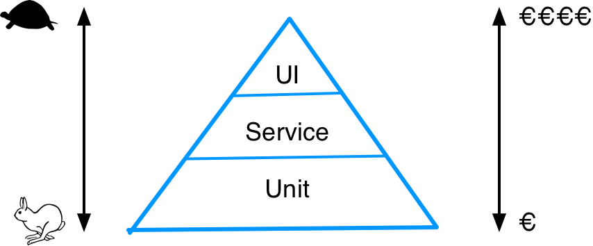

== Introduction aux tests

=== Les types de tests

* Tests unitaires
* Tests d'intégration
* Tests fonctionnels
* Tests de montée en charge
* et d'autres encore
** tests d'accessibilité, de compatibilité W3C, d'utilisabilité, etc.

=== La pyramide des tests de Mike Cohn

Plus on se rapproche du sommet de la pyramide plus on test la solution intégrée, plus cela est couteux en ressources.

=== Pourquoi tester les logiciels ?

* https://fr.wikibooks.org/wiki/Introduction_au_test_logiciel/Introduction
* https://martinfowler.com/articles/practical-test-pyramid.html