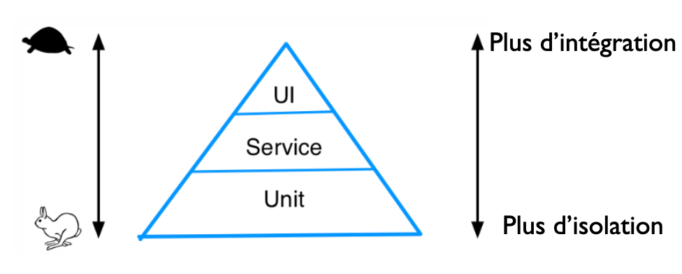

== Introduction aux tests

=== Les types de tests

* Tests unitaires
* Tests d'intégration
* Tests fonctionnels
* Tests de montée en charge
* et d'autres encore
** tests d'accessibilité, de compatibilité W3C, d'utilisabilité, etc.
** https://glossary.istqb.org/en/search/testing

=== La pyramide des tests de Mike Cohn

* Plus on se rapproche du sommet de la pyramide plus on test la solution intégrée, plus cela est couteux en ressources.
* Les tests _UI_ sont souvent désignés par les expressions "tests fontionnels" ou "tests _end-to-end_".

=== Pourquoi tester les logiciels ?

* Améliorer la qualité du logiciel
* Vérifier que les changements n'induisent pas de bugs 
** Tests de (non) régression
* Quelques liens intéressants
** https://fr.wikibooks.org/wiki/Introduction_au_test_logiciel/Introduction
** https://martinfowler.com/articles/practical-test-pyramid.html

=== Quelques limites 

* Les tests ne garantissent pas le bon fonctionnement de l'application
* L'évaluation est toujours partielle
* Un test peut contenir des _bugs_