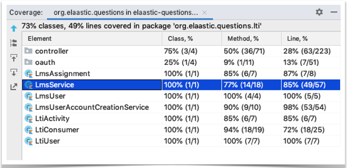
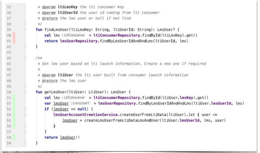
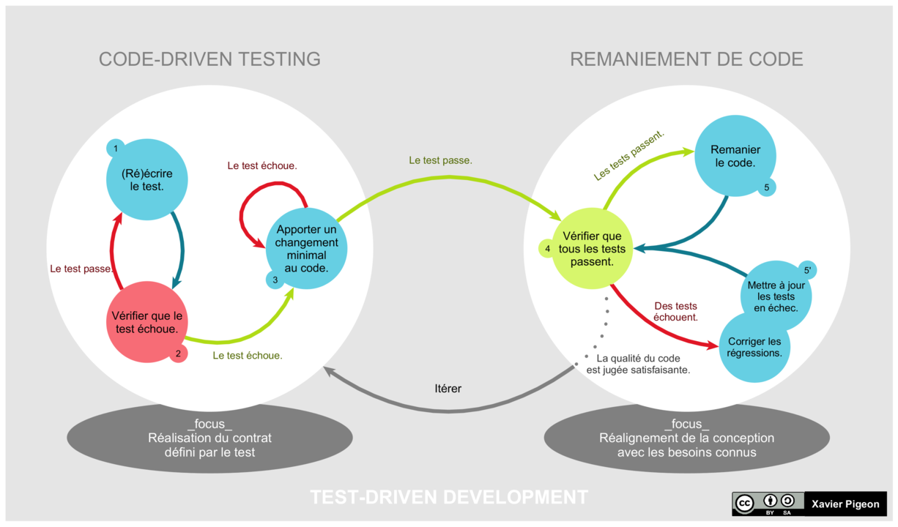

== Les tests unitaires 

=== Focus sur les tests unitaires (TU)

* Les TU isolent chaque "unité" du programme pour vérifier qu'il fonctionne comme spécifié
* Les TU définissent le contrat que l'unité de code doit satisfaire
* Le contrat est *exécutable* => Automatisation
* En POO, l'unité de code est en général la classe

=== Un test unnitaire doit être...

* Isolé (indépendant de tous les autres tests)
* Déterministe (reproductible)
* Simple et rapide à développer et à exécuter
* Exécutable de manière automatique
* Limité à une unité de code isolée

=== Physionomie d'un test

* Given ...
** Construction de "l'état du monde" (_fixture_)
* When ...
** Exécution du code à tester
* Then ...
** Vérification du résultat obtenu (assertions, métaphore de l'oracle)

=== Quelques exemples

* Avec JUnit en Java pour tester du code Java
** https://github.com/spring-projects/spring-framework/blob/master/spring-core/src/test/java/org/springframework/core/io/ClassPathResourceTests.java 
* Avec JUnit en Kotlin pour tester du code Kotlin
** https://github.com/elaastic/elaastic-questions-server/blob/develop/src/test/kotlin/org/elaastic/questions/lti/LmsServiceIntegrationTest.kt 
* Avec Spock en Groovy pour tester du code Java
** https://github.com/elaastic/elaastic-questions/blob/develop/test/integration/org/tsaap/assignments/AssignmentServiceIntegrationSpec.groovy 

=== Quoi tester ?

* Une classe de test pour chaque classe à tester
* On teste uniquement l'interface publique d'un objet
* On teste le comportement observable d'un objet
* On ne teste pas le code trivial

NOTE: Thanks'to Hame Vocke

=== Quels cas tester ?

* Les cas de succès : exécution nominale du programme
* Les cas d'erreurs : test de la gestion des erreurs
* Cas limites : test de la robustesse

=== Type de _feedback_ de tests

* Succès : le test passe avec succès
* Échec (_Failure_) : au moins une assertion est non vérifiée
* Erreur : erreur à l'exécution non prévue  

=== La couverture du code par les tests

* Quand sait-on si on a écrit assez de tests ?
* La couverture du code (_code coverage_) est un idicateur objectif => pas d'indications sur la qualité des tests écrits

ifdef::backend-revealjs[=== !]

.Couverture du code dans Intellij, résulats globaux

ifdef::backend-revealjs[=== !]

.Couverture du code dans Intellij, détail pour une classe

=== Conseils méthodologiques

* Pour écrire des tests unitaires...
** Les composants doivent être séparables (séparation des responsabilités)
** Les composants doivent être simples
* Plutôt que de _debugger_ à coup de _println_, évrivez un test !
* Quand vous trouvez un _bug_, écrivez un test pour le reproduire et le caractériser

== _Test Driven Development_ (TDD)

=== Générlité sur le TDD

* Conçu initialement par Erich Gamma et Kent beck.
* Utilisation des tests unitaires comme spécification exécutable du code principal. 
* S'intègre généralement dans les pratiques d'ingénierie d'approches agiles (eXtreme Programming, Scrum).
* Plus qu'une approche pour écrire des tests, une approche de conception.

=== Le cycle TDD

.Le cycle TDD en image

Par Xarawn — Travail personnel, CC BY-SA 4.0, https://commons.wikimedia.org/w/index.php?curid=44782737

=== Le _refactoring_

* Processus consistant à modifier la structure d'un code existant sans changer le comportement attendu.
* Exemple de tâches de _refactoring_
** Déplacer du code en vue de respecter une meilleure séparation des responsabilités
** Suppression du code dupliqué
** Renommer les noms de variables et méthodes avec des noms auto-documentés
** Diviser les méthodes en plusieurs méthodes plus petites
** Réorganiser les hiérarchies de classe

=== Bénéfices du TDD

* Force à penser les interfaces du programme : on les utilise dans les tests avant qu'elles soient implantées.
* Induit une meilleure conception : meilleure modularisation induite par du code testable _by design_.
* Construction simultanée du programme et de la suite de tests de non régression.
* Pour en savoir davantage : https://en.wikipedia.org/wiki/Test-driven_development#Benefits[Bénéfices du TDD sur Wikipedia]