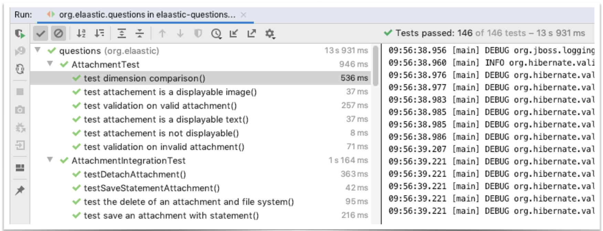
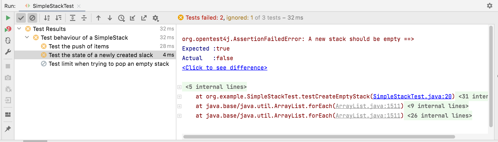

== Introduction à JUnit 

=== JUnit

* Framework pour la construction et l'exécution de tests unitaires en Java.
* https://github.com/junit-team/junit[Open Source]
* Integration dans tous les éditeurs modernes (IntelliJ, Eclipse, VSCode) 
* Intégration dans les outils de _build_ (Gradle, Maven)
* Très massivement utilisé dans l'industrie

=== Les bénéfices principaux

* Facilités pour la coneption de tests unitaires
* Lancement automatique des suites de tests
* Génération de rapports d'executions

=== Exemple de rapport généré dans IntelliJ

.Rapport JUnit dans IntelliJ

=== Exemple simple 

* Une interface décrivant le comportement d'une pile : ``Stack``
* Une première implantation vide : ``SimpleStack``
* Une classe de test unitaire : ``SimpleStackTest``

=== L'interface ``Stack``

[source,Java]
----
public interface Stack {

 /**
 * Tests if this stack is empty
 */
 public boolean isEmpty();

 /**
 * Returns the number of items in this stack.
 */
 public int getSize();

 /**
 * Pushes an item onto the top of this stack.
 * null item is allowed.
 */
 public void push(Item item);

 /**
 * Looks at the object at the top of this stack without removing it from the stack.
 */
 public Item peek() throws EmptyStackException;

 /**
 * Removes the object at the top of this stack and returns 
 * that object as the value of this function.
 * @throws EmptyStackException if this stack is empty.
 */
 public Item pop() throws EmptyStackException;

 }
----

=== La classe ``SimpleStack``

[source,Java]
----
public class SimpleStack implements Stack {
    
   @Override
   public boolean isEmpty() {
   return false;
   }
    
   @Override
   public int getSize() {
   return 0;
   }
    
   @Override
   public void push(Item item) {
   }
    
   @Override
   public Item peek() throws EmptyStackException {
   return null;
   }
    
   @Override
   public Item pop() throws EmptyStackException {
   return null;
   }
}
----

=== La classe ``SimpleStackTest`` en JUnit5 1/2

[source,Java]
----
import org.junit.jupiter.api.Disabled;
import org.junit.jupiter.api.DisplayName;
import org.junit.jupiter.api.Test;

import static org.junit.jupiter.api.Assertions.*;

@DisplayName("Test behaviour of a SimpleStack")
class SimpleStackTest {

    @Test // <1>
    @DisplayName("Test the state of a newly created slack") // <2>
    public void testCreateEmptyStack() { // Test case

        // When a freshly stack is created
        Stack stack = new SimpleStack();

        // Then… (oracle)
        assertTrue(stack.isEmpty(), "A new stack must be empty"); // <3>
        assertEquals( 0, stack.getSize(), "A new stack has no element");
    }
    //…
}
----
<1> Identification d'une méthode de test
<2> Spécification de l'affichage dans le rapport de test
<3> Une assertion

=== La classe ``SimpleStackTest`` en JUnit5 2/2

[source,Java]
----
    //...
    @Test
    @Disabled // <1>
    @DisplayName("Test limit when trying to pop an empty stack")
    public void testPopOnEmptyStack()  {
        // Given an empty stack
        Stack stack = new SimpleStack();

        // When we "pop" the stack, should throws an EmptyStackException.
        //assertThrows(EmptyStackException.class, ()->stack.pop()); <3>
        assertThrows(EmptyStackException.class, stack::pop, "EmptyStackException not thrown"); // <2>
    }
    // ...
----
<1> Permet de désactiver le test
<2> Assertion spécifique pour tester une levée d'exception
<3> Variante de l'assertion qui utilise une lambda expression

=== La classe ``SimpleStackTest`` - rapport de test

.Rapport de tests dans IntelliJ

=== Terminologie JUnit

Classe de test:: contient plusieurs cas de test (sur la même classe)
Méthode de test:: un scénario de test (sur une méthode)
Assertion:: expression dont on veut vérifier la véracité
Fixture:: construction d'un état commun à plusieurs cas de test
Suite de test:: regroupement de classes de test qui peuvent être exécutées ensemble

=== Assertions principales

Une assertion non satisfaite lève une Error.

[cols="1,1"]
|===
|Instruction | Description 

|fail(message)
|Déclenche un échec de la méthode de test

|assertTrue(condition, [message])
|Teste si la condition est vraie

|assertEquals(expected, actual, [message])
|Teste si les valeurs sont égales

|assertSame(expected, actual, [message])
|Teste si les variables référencent le même objet

|assertNotSame(expected, actual, [message])
|Teste si les variables ne référencent pas le même objet

|assertNull(object, [message])
|Teste si l'objet est null

|assertNotNull(object, [message])
|Teste si l'objet n'est pas null

|assertThrows(expectableThrowableType, executableCode,  [message])
|Teste si le code exécutable lève une exception du type attentu
|=== 

=== Annotations principales

[cols="1,1"]
|===
|Annotation | Description 

|@Test
|Définit une méthode de test

|@Before
|Méthode exécutée avant chaque méthode de test

|@After
|Méthode exécutée après chaque méthode de test

|@BeforeAll
|Méthode exécutée avant la première méthode de test

|@AfterAll
|Méthode exécutée après la dernière méthode de test
|===

=== Conseils pratiques

* Une classe de test par classe 
** ``<nomClasse>Test``
* Une ou plusieurs méthodes de test par méthode de classe 
** ``test<nomMethode>[<cas>][<attendu>]``
* Fichiers sources des classes de test séparés des fichiers sources des classes principales.
** ``/src/\*`` et ``test/*`` 